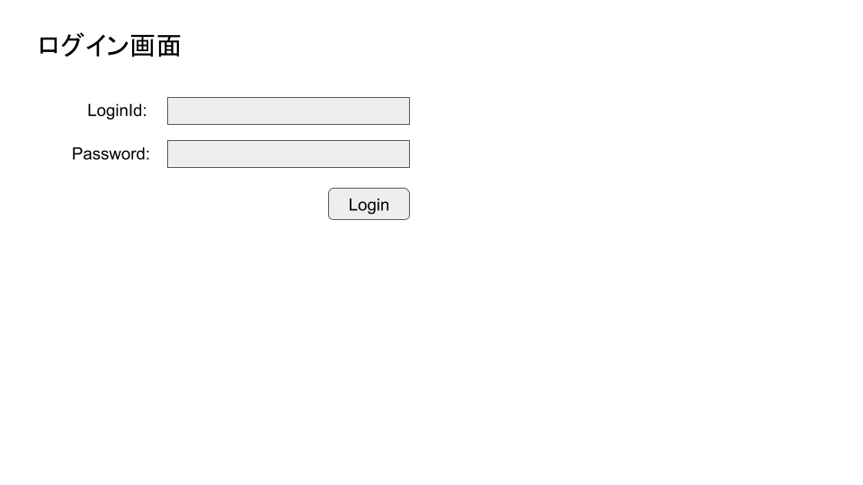
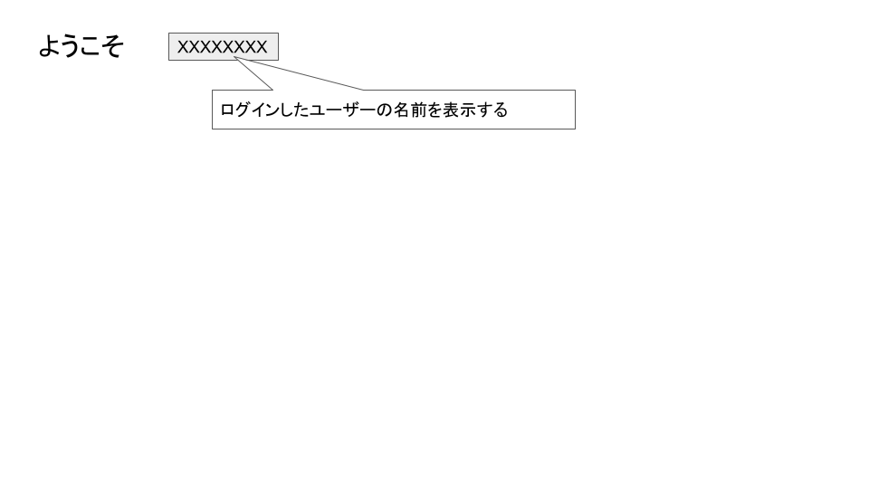

# 4/26の授業内容
1. 前回の授業の振り返り
2. expressを使ってAPIサーバを構築してみる

---
## 前回の授業の振り返り
* [前回の授業](../0419/README.md)
* [コーディング試験のサンプル](https://www.yumemi.co.jp/serverside_recruit)

---
## 静的コンテンツの表示
[こちらのページ](https://expressjs.com/ja/starter/static-files.html)を参考に画像を埋め込んだページを表示する。

---
## テンプレートエンジン
[こちらのページ](https://www.digitalocean.com/community/tutorials/how-to-use-ejs-to-template-your-node-application-ja)を参考に以下のページを表示できるようにする

---
## 課題
以下のアプリケーションを作成する
1. Webブラウザからルートパスにアクセスすると以下のようなログイン画面を表示する

2. ログイン画面で「ログイン」を押下すると、メイン画面を表示する

* 条件
  * LoginId,Passwordが一致しないときにはログイン画面にエラーメッセージを表示する
  * メイン画面に表示する名前はLoginIdで切り替わるようにすること

* 期限
5/16(月) 17:00
