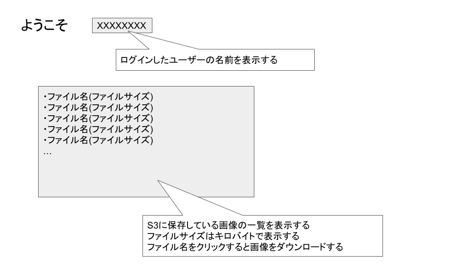

# 5/31の授業内容
1. 前回の授業の振り返り
2. AWS SDK for JavaScript

---
# 前回の授業の振り返り
* [前回の授業](../0524/README.md)

---
# [AWS SDK for JavaScript](https://aws.amazon.com/jp/sdk-for-javascript/)

AWS SDK for JavaScriptを使ってS3にアクセスしてみる。

## 準備
1. AWS SDK for JavaScriptのインストール
自身のアプリのディレクトリで以下のコマンドを実行してSDKをインストールする

    `npm install @aws-sdk/client-s3`

2. 画像を保管するBucketを作成する
AWS Consoleを使用して画像を保管するBucketをS3上に作成する

3. 作成したBucketに画像をアップロードする
AWS Consoleを使用して画像をBucketにアップロードする

4. デフォルトのリージョンを設定する  
`aws configure`を実行してリージョン(regin)に `us-east-1`を指定する  
リージョン以外は空EnterでOK

5. EC2にロールを設定する
* EC2を選択
* Action -> Security -> Modify IAM Role
* EMR_EC2_DefaultRoleを選択する

## S3に保管されている画像をダウンロードする
S3に保管されている画像をダウンロードするアプリを作成する

1. S3のBucket内の画像の一覧を取得する
2. 画像の一覧をループして画像をすべてダウンロードする

## 使用するAPI
* listObjects: S3のBucket内のオブジェクトの一覧を取得  
[sample code](./list_sample.js)

* getObject: S3のBucket内のオブジェクトをダウンロード  
[sample code](./download_sample.js)

## expressでファイルをダウンロードする
[sample code](./download_sample_express.js)

---
# 課題
ログイン後の画面にS3に保管されている画像の一覧を表示する

* 期限: 6/27(月) 17:00
